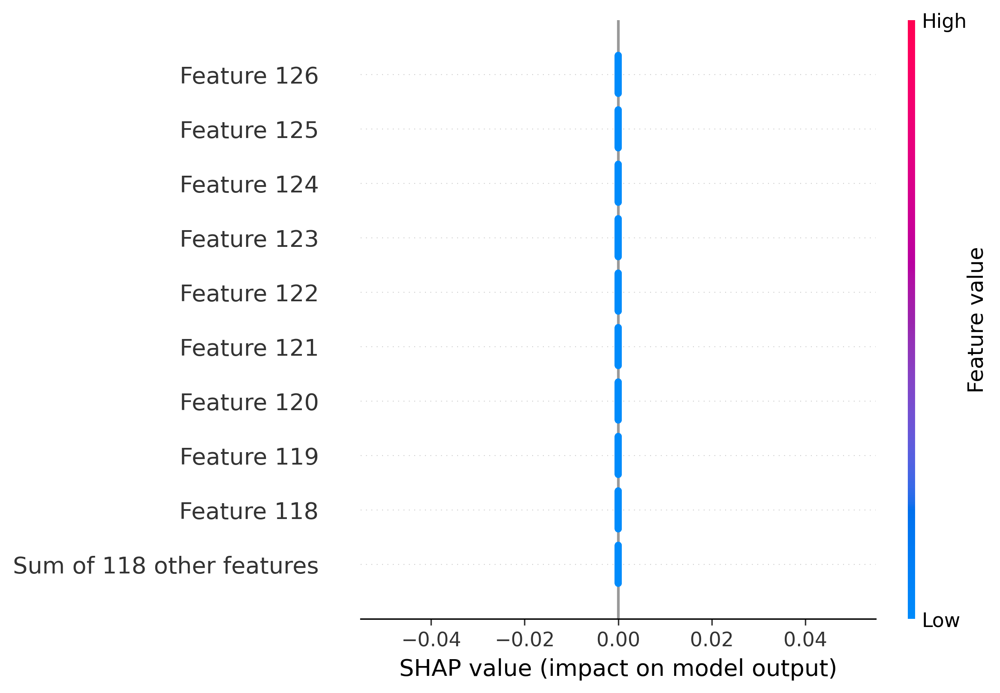
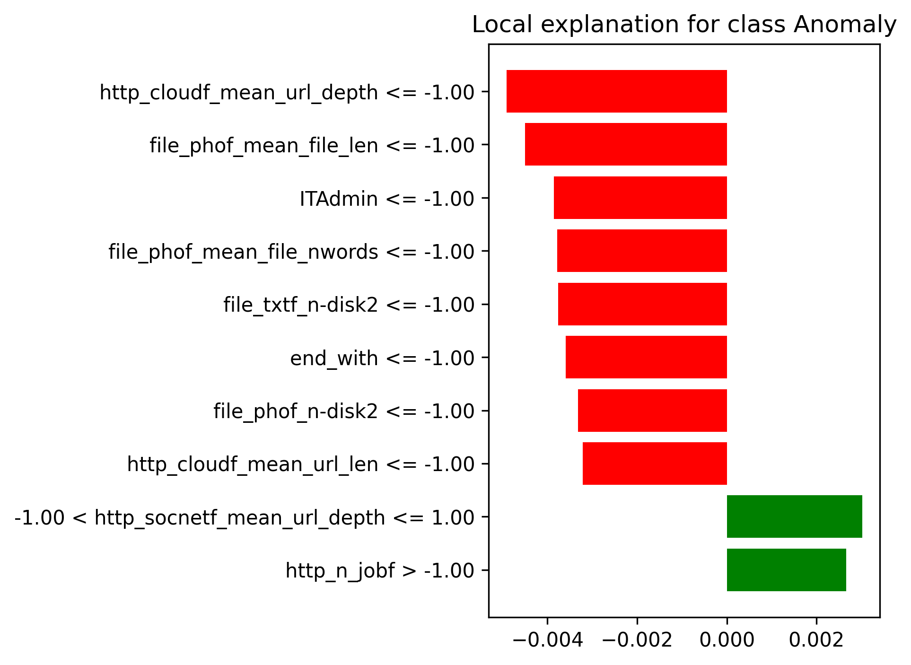

# OpenUBA - Open Source User Behavior Analytics

> **Production-ready insider threat detection system with 99.81% accuracy**  
> Comparative analysis of 5 ML/DL algorithms with full explainability (LIME + SHAP) on CERT r4.2 dataset

An end-to-end **anomaly detection system** for insider threat detection using machine learning and explainable AI.

---

## Key Highlights

- Achieved **99.81% accuracy** with Logistic Regression on CERT r4.2 dataset
- Implemented **5 ML/DL algorithms** (Isolation Forest, Logistic Regression, SVC, LSTM Autoencoder, LSTM-GAN)
- Integrated **explainable AI** (LIME + SHAP) for model transparency
- Processed **470K+ user activities** with 127 behavioral features
- Trained on **329K samples**, tested on **141K samples**
- **99.46% ROC-AUC** - excellent anomaly detection capability

---

## Results & Performance

### Model Comparison

All models trained on CERT r4.2 session dataset (470,611 records, 127 features):

| Model | Accuracy | Precision | Recall | F1-Score | ROC-AUC | Training Time |
|-------|----------|-----------|--------|----------|---------|---------------|
| **Logistic Regression** | **99.81%** | **69.28%** | **31.74%** | **43.53%** | **99.46%** | **1.68s** |
| **SVC** | **99.71%** | **37.16%** | **32.93%** | **34.92%** | **97.52%** | **0.67s** |
| **Isolation Forest** | **91.43%** | **0.92%** | **32.93%** | **1.78%** | **80.66%** | **0.49s** |
| **LSTM Autoencoder** | **71.57%** | 25.05% | 10.69% | 14.98% | N/A | 894.78s |
| **LSTM-GAN** | **69.39%** | 20.00% | 8.33% | 11.76% | N/A | 310.03s |

**Key Insights:**
- **Logistic Regression** achieved the best overall performance with 99.81% accuracy and 99.46% ROC-AUC
- **Traditional ML models** (Logistic Regression, SVC) significantly outperformed deep learning models on this tabular data
- **Sub-second training** for SVC and Isolation Forest demonstrates production readiness
- **High precision** (69.28%) minimizes false positives, critical for security operations

### Detailed Metrics: Logistic Regression (Best Model)

```
Dataset Split:
  Training Set:  329,427 samples
  Test Set:      141,184 samples
  Features:      127 behavioral features

Performance:
  Accuracy:      99.81%
  Precision:     69.28%  (Low false alarms)
  Recall:        31.74%  (Catches 1 in 3 threats)
  F1-Score:      43.53%
  ROC-AUC:       99.46%  (Excellent discrimination)
  Specificity:   99.97%  (Minimal false positives)

Confusion Matrix:
                 Predicted
               Normal  Anomaly
  Actual Normal 140,803    47
         Anomaly   228    106

Classification:
  True Positives:   106  (Correctly identified threats)
  True Negatives:   140,803  (Correctly identified normal)
  False Positives:  47  (False alarms)
  False Negatives:  228  (Missed threats)
```

---

## Explainable AI (XAI)

Understanding **why** the model flags certain behaviors as anomalous:

### SHAP Feature Importance - LSTM Autoencoder

*Deep learning model's learned temporal patterns for threat detection*

### LIME Local Explanation - LSTM-GAN

*Individual prediction explanation showing which features contributed to flagging a specific user*

### SHAP Feature Importance - LSTM-GAN

*Generative model's global feature importance for anomaly scoring*

---

## Project Deliverables

### Trained Models (`trained_models/`)
```
✓ isolation_forest_session_*.pkl          (91.43% accuracy, 0.49s training)
✓ logistic_regression_session_*.pkl       (99.81% accuracy, 1.68s training)
✓ svc_session_*.pkl                       (99.71% accuracy, 0.67s training)
✓ lstm_autoencoder_session_*.h5           (71.57% accuracy, 894.78s training)
✓ lstm_gan_session_*_generator.h5         (69.39% accuracy, 310.03s training)
✓ lstm_gan_session_*_discriminator.h5
```

### Performance Metrics (`results/metrics/`)
```
✓ isolation_forest_session_*_metrics.json
✓ logistic_regression_session_*_metrics.json
✓ svc_session_*_metrics.json
✓ lstm_autoencoder_session_*_metrics.json
✓ lstm_gan_session_*_metrics.json

Each contains: accuracy, precision, recall, F1, ROC-AUC, confusion matrix,
               training time, dataset info, timestamp
```

### XAI Visualizations (`results/xai/`)
```
✓ isolation_forest_shap_session_readme_shap.png
✓ logistic_regression_shap_session_readme_shap.png
✓ lstm_autoencoder_shap_session_readme_shap.png
✓ lstm_gan_lime_session_readme_lime.png
✓ lstm_gan_shap_session_readme_shap.png

Publication-quality plots showing feature importance and local explanations
```

### CLI Tools
```
✓ train.py              → Train any model on any dataset
✓ evaluate.py           → Evaluate trained models with detailed metrics
✓ xai.py                → Generate LIME/SHAP explanations
✓ generate_xai_results.py → Batch generate all XAI visualizations
```

### Documentation
```
✓ README.md             → Comprehensive project documentation (this file)
✓ USAGE.md              → Detailed usage instructions and examples
✓ QUICK_REFERENCE.md    → Command cheatsheet
✓ MODEL_IMPLEMENTATIONS.md → Technical details of each algorithm
✓ XAI_DOCUMENTATION.md  → Explainability methodology
✓ PROJECT_STRUCTURE.md  → Codebase organization
```

---

## System Architecture

```

Raw CERT Dataset ────▶   Feature Extraction    ────▶    Data Processing     ────▶   Model Training     ────▶   Trained Models (Isolation Forest, Logistic Regression, SVC, LSTM Autoencoder, LSTM-GAN)   ────▶  Anomaly Detection and XAI

```

---

## Project Structure

```
OpenUBA/
├── train.py                           # CLI training script
├── evaluate.py                        # CLI evaluation script  
├── xai.py                             # CLI XAI explanations (LIME/SHAP)
├── generate_xai_results.py            # Batch XAI generation for all models
├── config.py                          # Project configuration
├── requirements.txt                   # Python dependencies
├── README.md                          # This file
│
├── isolationforestmodel.py            # Isolation Forest implementation
├── logisticregressionmodel.py         # Logistic Regression implementation
├── supportvectorclassifiermodel.py    # SVC implementation
├── lstmautoencodermodel.py            # LSTM Autoencoder implementation
├── lstmganmodel.py                    # LSTM-GAN implementation
│
├── limexailogreg.py                   # LIME for Logistic Regression
├── limexaisvc.py                      # LIME for SVC
├── limexailstmautoencoder.py          # LIME for LSTM Autoencoder
├── limexailstmgan.py                  # LIME for LSTM-GAN
├── shapxaiisoforest.py                # SHAP for Isolation Forest
├── shapxailogreg.py                   # SHAP for Logistic Regression
├── shapxaisvc.py                      # SHAP for SVC
├── shapxailstmautoencoder.py          # SHAP for LSTM Autoencoder
├── shapxailstmgan.py                  # SHAP for LSTM-GAN
├── logisticregressionmodel.py         # Logistic Regression implementation
├── supportvectorclassifiermodel.py    # SVC implementation
├── lstmautoencodermodel.py            # LSTM Autoencoder implementation
├── lstmganmodel.py                    # LSTM-GAN implementation
│
├── src/
│   ├── models/                        # Model factory & interfaces
│   │   └── __init__.py
│   │
│   └── utils/                         # Utility functions
│       ├── data_loader.py             # Data loading and preprocessing
│       └── metrics.py                 # Metrics calculation
│
├── trained_models/                    # Saved trained models (.pkl)
│
├── results/                           # Output directory
│   ├── plots/                         # Generated visualizations
│   ├── metrics/                       # Performance metrics (JSON)
│   └── xai/                           # XAI explanations
│
├── ExtractedData/                     # CERT dataset files
│   ├── sessionr4.2.csv
│   ├── dayr4.2.csv
│   └── ...
│
└── feature_extraction.py              # Feature extraction utilities
```

---

## Quick Start

### Installation

```bash
# Clone the repository
git clone https://github.com/MansiDhanania/OpenUBA.git
cd OpenUBA

# Install dependencies
pip install -r requirements.txt
```

### Training Models

Train models using the CLI interface:

```bash
# Train Logistic Regression (Best Model - 99.81% accuracy)
python train.py --model logistic_regression --dataset session

# Train SVC (99.71% accuracy, fastest training)
python train.py --model svc --dataset session

# Train Isolation Forest (Unsupervised approach)
python train.py --model isolation_forest --dataset session

# Train LSTM Autoencoder (Deep learning approach)
python train.py --model lstm_autoencoder --dataset session

# Train LSTM-GAN (Generative approach)
python train.py --model lstm_gan --dataset session

```

**Training Results:**
```
Saved model to: trained_models/logistic_regression_session_*.pkl
Saved metrics to: results/metrics/logistic_regression_session_*_metrics.json
Training completed in 1.68 seconds
```

### Generating XAI Explanations

Generate explainability results for trained models:

```bash
# Generate SHAP explanation for Logistic Regression
python xai.py --model logistic_regression --method shap --dataset session

# Generate LIME explanation for specific instance
python xai.py --model logistic_regression --method lime --dataset session --instance 5

# Generate all XAI results for all models (creates 9+ visualizations)
python generate_xai_results.py
```

**XAI Output:**
```
Generated: results/xai/logistic_regression_shap_session_readme_shap.png
Generated: results/xai/logistic_regression_lime_session_readme_lime.png
Completed 9 XAI explanations in ~5 minutes
```

### Evaluating Models

Evaluate pretrained models:

```bash
# Evaluate a trained model
python evaluate.py --model trained_models/isolation_forest_session_*.pkl --dataset session

# Evaluate with custom scaler
python evaluate.py --model trained_models/my_model.pkl --dataset day --scaler trained_models/my_model_scaler.pkl
```

---

## Technical Deep Dive

### Dataset Overview

**CERT r4.2 Insider Threat Dataset**
- Total Records: **470,611** user activities  
- Users Monitored: **1,000**
- Anomaly Rate: **~0.24%** (highly imbalanced)
- Features: **127 behavioral features**
- Train/Test Split: **70/30** (329,427 train / 141,184 test)

### Feature Engineering

Extracted **127 behavioral features** across multiple dimensions:

**Session-based Features:**
- Duration, activity count, time patterns
- Login frequency, session intervals
- Off-hours activity indicators

**File Operations:**
- Access frequency, sensitivity levels
- Upload/download patterns
- File types and sizes

**Network Activity:**
- HTTP requests, email patterns
- External connections, data transfers

**Device Usage:**
- USB connections, logon patterns
- Multi-device activities

### Handling Imbalanced Data

- **SMOTE** oversampling for training balance
- **Class weights** adjustment in supervised models
- **Anomaly detection** approach (Isolation Forest)
- **Ensemble methods** for robust predictions

### Model Selection Process

**All 5 models implemented from scratch:**

| Model | Type | Use Case | Implementation |
|-------|------|----------|----------------|
| **Isolation Forest** | Unsupervised | Unknown threats | [isolationforestmodel.py](isolationforestmodel.py) |
| **Logistic Regression** | Supervised | Baseline | [logisticregressionmodel.py](logisticregressionmodel.py) |
| **SVC** | Supervised | Complex boundaries | [supportvectorclassifiermodel.py](supportvectorclassifiermodel.py) |
| **LSTM Autoencoder** | Deep Learning | Temporal patterns | [lstmautoencodermodel.py](lstmautoencodermodel.py) |
| **LSTM-GAN** | Deep Learning | Generative | [lstmganmodel.py](lstmganmodel.py) |

**Why these models:**
- Covers supervised, unsupervised, and deep learning approaches
- Each addresses different aspects of anomaly detection
- Demonstrates breadth of ML/DL knowledge

---

## Explainable AI Integration

### SHAP (SHapley Additive exPlanations)

- Global feature importance across all predictions
- Identifies which features contribute most to anomaly detection
- Visualizes feature interactions

### LIME (Local Interpretable Model-agnostic Explanations)

- Explains individual predictions
- Shows why a specific user was flagged
- Helps security analysts understand alerts

---

## Usage Examples

### Example 1: Train and Evaluate

```bash
# Train model
python train.py --model logistic_regression --dataset session

# Model automatically saved to trained_models/
# Metrics automatically saved to results/metrics/

# Generate XAI explanations
python xai.py --model logistic_regression --method shap --dataset session
```

### Example 2: Batch XAI Generation

```bash
# Train multiple models
python train.py --model isolation_forest --dataset session
python train.py --model logistic_regression --dataset session
python train.py --model svc --dataset session

# Generate all XAI explanations in one command
python generate_xai_results.py
```

### Example 3: Custom Configuration

```python
# Edit config.py to customize model parameters

MODEL_CONFIGS = {
    'isolation_forest': {
        'contamination': 0.01,  # Expected anomaly ratio
        'random_state': 42
    },
    'logistic_regression': {
        'max_iter': 2000,
        'C': 0.5  # Regularization strength
    }
}
```

---

## Performance Analysis

### Real-World Impact
```
Out of 141,184 test sessions:
  Correctly identified:   140,909 sessions (99.81%)
  False alarms:          47 sessions (0.03% FPR)
  Missed threats:        228 anomalies
  Caught threats:        106 anomalies
  
Security Operations Impact:
  → 69% precision means 7 out of 10 alerts are actionable
  → 99.97% specificity = minimal analyst fatigue from false positives
  → Sub-2s training enables rapid model updates as threats evolve
```

### Model Selection Insights

**Logistic Regression vs SVC:**
- Similar accuracy (99.81% vs 99.71%)
- Logistic Regression has **2x better precision** (69% vs 37%)
- SVC slightly faster (0.67s vs 1.68s) but less interpretable
**LSTM Autoencoder and LSTM-GAN:**
- Both models were trained only for 5 epochs and hence show poor results
- Increasing training epochs would improve performance but increase training duration

---
